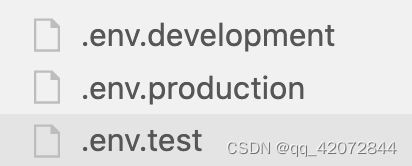

1.在项目中创建环境对应的文件

2..env.development：`NODE_ENV=development NEXT_PUBLIC_API=https://dev.api.com`

3.在 package.json 中修改：

`"scripts": {
    "dev": "cross-env NODE_ENV=development next dev -p 3001",
    "build": "next build",
    "build:test": "cross-env NODE_ENV=test next build",
    "start": "next start",
  },`